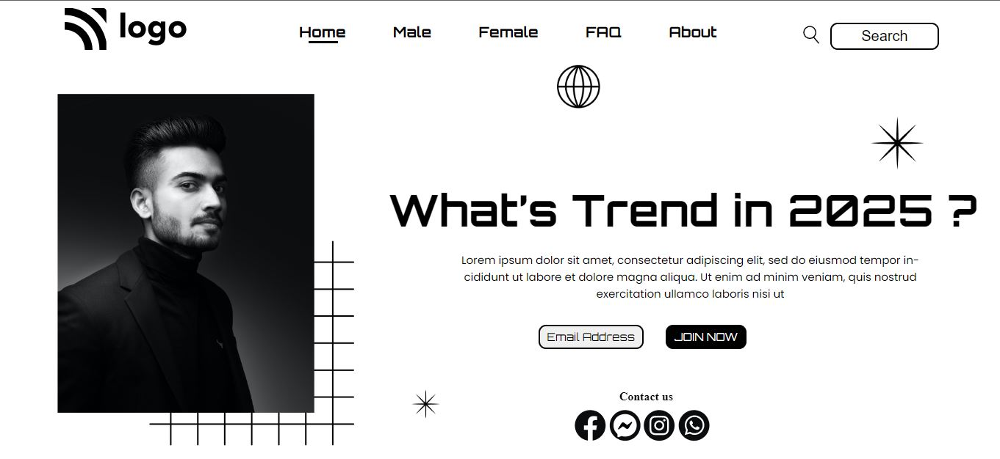

# Street Style Landing Page   
  
 This is a landing page made for learning purposes using `CORE CSS` and `HTML`. As of now, this is not responsive.

Made by - **Robin Khilery**

Duration : **4 Hours**

***
 
## :clipboard: Learnings
Learnt  about `DOM Structure` ,effective implementation of `Postion Property` and  
some of `pseudo-selectors` like `before` and `after`.

## Deployed Link
 [click here to see deployed version](https://street-style-link.netlify.app/ "Click to Visit Link") 

## Screenshots

 